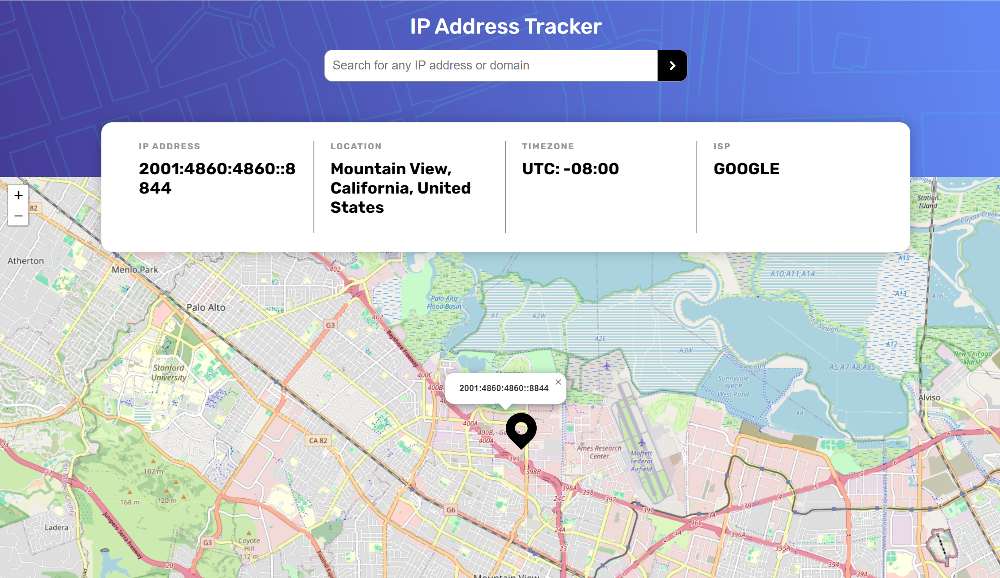

<h1 align="center">IP Address Tracker</h1>

challenge from <a href="https://www.frontendmentor.io">Frontend Mentor</a>

<h2 align="center"><a href="https://saem843.github.io/IP-Address-Tracker/">🚀Live Site</a>||<a href="./README.md">README in English</h2></a>

このアプリケーションはアクセスしたユーザーの国や地域、IPアドレス等の情報を取得することが出来ます。　またユーザーがIPアドレスを入力し、それに該当する国や地域の情報を取得することもできます。

## 💡Key Features

アクセスしたユーザーは、

- 自分の IP アドレスを確認、また地図で場所を確認することが可能。
- 気になる IP アドレスを入力し、それに付随する情報を確認することが可能。

## ⚒️Built with

- HTML
- SASS
- JavaScrip
- [LeafletJS](https://leafletjs.com/)
- [ipapi](https://ipapi.co/)
